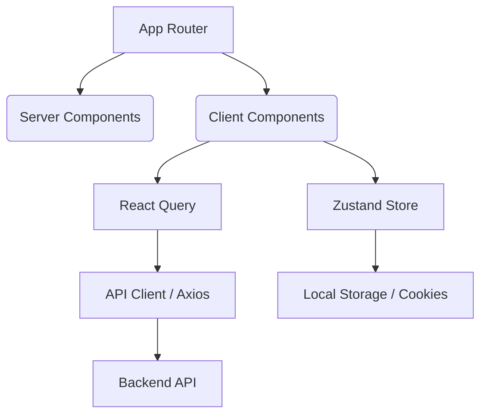

<div align="center">
  
  <h1>🚀 SHOGOL - Freelancing Revolution</h1>
  <p><b>Next-Generation Freelance Platform built with Next.js 15, TypeScript, & Framer Motion.</b></p>
  
  [](https://nextjs.org/)
  [](https://www.typescriptlang.org/)
  [](https://tailwindcss.com/)
  [](https://tanstack.com/query)
  [](https://github.com/pmndrs/zustand)
</div>

---

## 🌟 Overview

**Shogol** (شغل) is a premium, high-performance freelancing ecosystem designed to bridge the gap between talented creators and ambitious clients. Focused on a "Mobile-First" and "Aesthetic-First" philosophy, Shogol delivers a sub-second response time and a glassmorphic UI that feels alive.

### 🎥 [Live Demo (Replace with your link)] | [Architecture Docs](#-architecture)

---

## ✨ Key Features

- **🌍 Full Bilingual Support**: Seamless RTL/LTR switching (Arabic/English) with a unified design system.
- **⚡ Advanced Search & Discovery**: Real-time filtering by skills, rating, and nationality using highly optimized API calls.
- **🎨 Premium UI/UX**:
  - **Glassmorphism Design**: Elegant blur effects and consistent spacing.
  - **Micro-animations**: Powered by Framer Motion for a "premium-weight" feel.
  - **Responsive Brilliance**: Pixel-perfect from 4K displays down to the smallest mobile devices.
- **🛡️ Secure Data Handling**: 
  - Strict **Zod** schema validation for all user inputs.
  - **React Query** for robust caching, stale-time management, and optimistic updates.
- **💬 Real-time Communication**: Integrated chat system (Conversation & Messages) with signalR library.
- **📋 Management Dashboard**: Full CRUD for Proposals, Announcements, and Job Requests.

---

## 🛠️ Tech Stack & Optimization

### **Core**
- **Next.js 16 (App Router)**: Utilizing Server Components for SEO and Client Components for interactivity.
- **TypeScript**: 100% type-safe codebase for long-term maintainability.
- **Zustand**: Lightweight, scalable state management for global UI and auth states.

### **Performance**
- **Max-Boost Hero Section**: Custom `fetchPriority` and optimized `framer-motion` variants to achieve an LCP < 1.2s.
- **Efficient Caching**: `TanStack Query` with fine-tuned `staleTime` and `gcTime`.
- **Image Optimization**: Using `next/image` with WebP format and priority preloading (LCP boost).
- **Zustand Persistence**: Securely managing auth and UI state across sessions.

---

## 💎 Technical Excellence

This project demonstrates several advanced software engineering practices:

- **Type-Direct Architecture**: Leveraging TypeScript to enforce correctness from the API layer down to the smallest UI atomic components.
- **RTL-Native Design System**: Built-in support for Arabic localization without sacrificing performance or visual quality.
- **Agent-Ready Codebase**: Clean, modular structure optimized for collaborative building and automated testing.
- **Validation-First**: Using Zod to sanitize all incoming and outgoing data, ensuring the frontend remains the ultimate source of truth for UI state.
- **Progressive Hydration**: Judicious use of Dynamic Imports and React Suspense boundaries to minimize the main thread workload.

---

## 🏗️ Architecture



Our architecture follows the **Container-Component Pattern** (see `/container` vs `/components`), ensuring a clean separation of business logic and UI presentation.

---

## 🚀 Getting Started

### Prerequisites
- Node.js 20+
- npm / pnpm / yarn

### Installation
1. Clone the repository:
   ```bash
   git clone https://github.com/AhmedAdel208/shogol.git
   ```
2. Install dependencies:
   ```bash
   npm install
   ```
3. Set up environment variables (`.env.local`):
   ```env
   NEXT_PUBLIC_API_URL=your_api_endpoint
   ```
4. Run the development server:
   ```bash
   npm run dev
   ```

---

## 👤 Author

**Ahmed Adel**  
*Full-Stack Engineer | UI/UX Specialist*  
[](https://linkedin.com/in/[your-link])
[](https://[your-portfolio].com)

---

<div align="center">
  <sub>Built with ❤️ by Shogol Dev Team.</sub>
</div>
