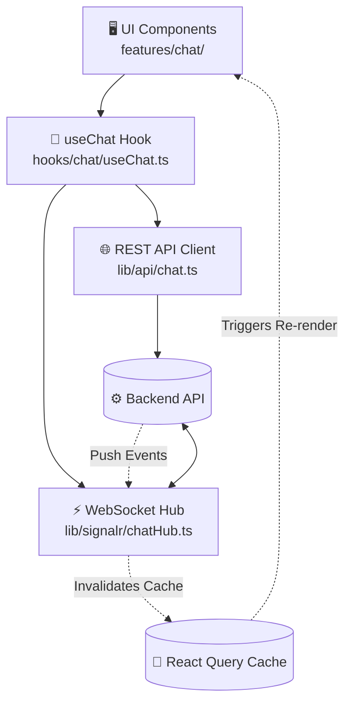
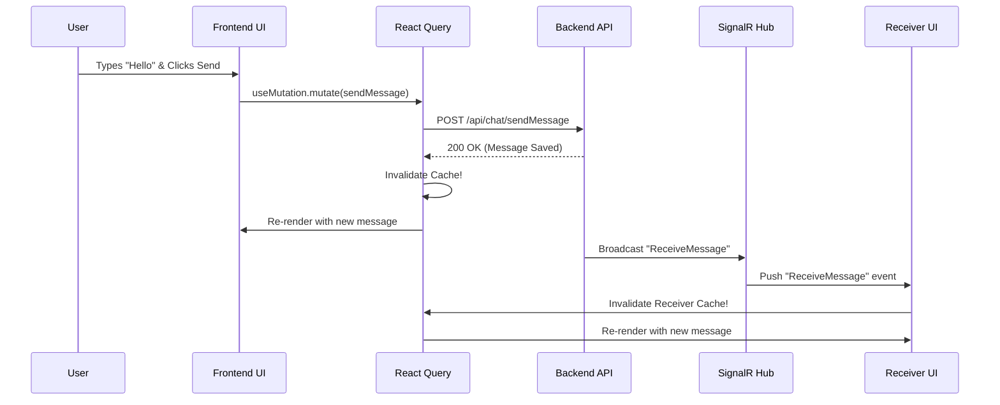

# 💬 The Complete Guide to the Shoogl Real-Time Chat Architecture

Welcome to the deep-dive technical documentation for the **Shoogl Real-Time Chat System**.

This system is built for performance, reliability, and modern user experience. It utilizes a hybrid architecture:
* **WebSockets (SignalR)**: For low-latency pushing of real-time events to the client.
* **REST APIs**: For historical data retrieval, authentication, and heavy actions (like sending attachments).
* **React Query**: For intelligent state management, caching, deduplication, and optimistic UI updates.

---

## 🏛️ High-Level Architecture

The chat ecosystem spans multiple layers of our React application. Here is how data flows between the backend and the UI components:



### 📂 Directory Structure

* **`lib/signalr/chatHub.ts`**: The SignalR connection manager, auto-reconnection logic, and event listeners.
* **`lib/api/chat.ts`**: The REST API client (`apiClient.get`, `apiClient.post`) for fetching messages and pushing content.
* **`hooks/chat/useChat.ts`**: The "Brain" – a massive custom React Hook that glues the UI to the data layer and WebSocket transport.
* **`features/chat/`**: Presentation components (`ChatHeader.tsx`, `ChatInput.tsx`, `EmptyChatState.tsx`) that consume the hook.

---

## 🔌 1. The Transport Layer: SignalR Initialization & Resiliency
File: `lib/signalr/chatHub.ts`

SignalR provides real-time, bi-directional communication. Instead of the client polling the server for new messages, the server pushes updates instantly.

### Connection Setup & JWT Auth
We lazy-load the connection only when the user is explicitly authenticated to save bandwidth.

```typescript
const HUB_URL = isProduction ? "/chatHub" : "https://shogol.runasp.net/chatHub";

function getConnection(): HubConnection {
  if (connection) return connection;

  connection = new HubConnectionBuilder()
    .withUrl(HUB_URL, {
      // 1. JWT Authentication (Read securely from Zustand/localStorage)
      accessTokenFactory: () => getToken(),
    })
    // 2. Maximum Resilience: Reconnects automatically on network drop 
    // using a backoff strategy (0s, 2s, 5s, 10s, 30s)
    .withAutomaticReconnect([0, 2000, 5000, 10000, 30000])
    .configureLogging(LogLevel.Warning)
    .build();

  return connection;
}
```

### Supported Real-Time Events
We export strongly-typed subscription functions that take a callback and return an **unsubscribe function** (preventing memory leaks in React).

* **`ReceiveMessage`**: Triggered when a message is received.
* **`UserOnline` / `UserOffline`**: Triggered dynamically to update user presence indicators.
* **`UserTyping`**: Pushes typing indicators (`{ conversationId, userId, isTyping }`).
* **`MessageRead`**: Read receipt confirmations.

---

## 💾 2. The Data Layer: REST APIs & React Query Hooks
File: `hooks/chat/useChat.ts`

While SignalR tells us *when* events happen, **React Query** manages the actual data state, ensuring we don't have duplicated loading states across components.

### Query Keys Strategy
We use strict Query Keys to isolate and strictly target our caches:
```typescript
const QUERY_KEYS = {
  conversations: ["chat-conversations"] as const,
  messages: (id: number) => ["chat-messages", id] as const,
  onlineUsers: ["chat-online-users"] as const,
};
```

### Fetching Historical Data
We use `useQuery` to fetch lists. Notice how we use `refetchInterval` as an ultimate fallback stringency (in case the WebSocket silently drops without triggering disconnect events):

```typescript
// 1. Fetch the inbox list
const conversationsQuery = useQuery({
  queryKey: QUERY_KEYS.conversations,
  queryFn: chatApi.getConversations,
  enabled: isAuthenticated,
  refetchInterval: 30_000, // Poll every 30s as a safety net
  staleTime: 0,
});

// 2. Fetch the active conversation history
const messagesQuery = useQuery({
  // Dynamically queries messages ONLY for the selected conversation
  queryKey: QUERY_KEYS.messages(selectedConversationId!),
  queryFn: () => chatApi.getMessages(selectedConversationId!),
  enabled: isAuthenticated && selectedConversationId !== null,
});
```

---

## 🚀 3. Sending an Action: Sequence Diagram
When a user clicks "Send", we use a `useMutation` to handle the REST call and update the UI instantly. Let's look at the lifecycle of a single message:



### The Mutation Code
```typescript
const sendMutation = useMutation({
  mutationFn: ({ receiverId, content, attachment }) => 
    chatApi.sendMessage(receiverId, content, attachment),
  onSuccess: () => {
    // 1. Tell React Query the sidebar is stale (updates latest message preview & timestamp)
    queryClient.invalidateQueries({ queryKey: QUERY_KEYS.conversations });
    
    // 2. Tell React Query the active messages are stale (fetches the new sent message)
    if (selectedIdRef.current) {
      queryClient.invalidateQueries({ queryKey: QUERY_KEYS.messages(selectedIdRef.current) });
    }
  },
});
```

---

## 🧠 4. Binding Real-time to Data: The `useChat` Bootstrap
File: `hooks/chat/useChat.ts`

This hook acts as the sync engine. Inside a `useEffect`, we start the SignalR hub and bind our event listeners to React Query invalidations.

```typescript
useEffect(() => {
  if (!isAuthenticated) return;

  const cleanups: (() => void)[] = [];

  const bootstrap = async () => {
    await startChatHub();

    // When a new message is received via WebSocket:
    cleanups.push(
      onReceiveMessage(() => {
        const activeId = selectedIdRef.current;
        
        if (activeId) {
          // A. If the user is currently viewing this exact chat, immediately refetch messages
          queryClient.refetchQueries({ queryKey: QUERY_KEYS.messages(activeId) });
          // B. Since they are looking at it, automatically mark it as read in the DB
          chatApi.markAsRead(activeId); 
        }
        
        // C. Always refresh the conversation list to update the sidebar preview/unread badge for ANY chat
        queryClient.refetchQueries({ queryKey: QUERY_KEYS.conversations });
      }),
    );
    
    // ... Subscriptions for typing and presence ...
  };

  bootstrap();
  
  // Cleanup connections on unmount to prevent duplicated event firing
  return () => { cleanups.forEach((fn) => fn()); };
}, [isAuthenticated, queryClient]);
```

---

## 🪄 5. UI Integration & "Auto-Start Chat" Magic

### Parsing the URL (`?user={id}`)
`useChat.ts` actively monitors the browser's URL using `useSearchParams`. This is incredibly useful for profile pages. If a user clicks "Message Me" on a freelancer's profile, they are redirected to `/messages?user=user_123`.

The hook automatically intercepts this:
```typescript
useEffect(() => {
  const userToChatId = searchParams.get("user");
  if (userToChatId) {
    // 1. Prevent chatting with yourself
    if (userToChatId === user?.id) return;

    // 2. Search if a conversation already exists in our inbox
    const target = conversations.find((c) => c.otherUserId === userToChatId);
    if (target) {
      // Open the existing conversation
      setSelectedConversationId(target.id);
      markReadMutation.mutate(target.id);
    } else {
      // 3. It's a brand new conversation! Set them as "pending"
      // The UI will show an empty chat box addressed to this user until the first message is sent.
      setPendingUserId(userToChatId);
    }
  }
}, [searchParams, conversations]);
```

### UI State Management
The `useChat` hook returns an enormous payload of reactive state designed to be consumed by components like `ChatHeader` or `ChatInput`:
* `isTyping`: Booleans tied to `setTimeout` debouncers to show typing indicators smoothly.
* `onlineUsers`: A `Set<string>` of user IDs that are currently online.
* `unreadCount`: Automatically derived from the conversations list.

## 🏁 Conclusion
The combination of `SignalR` for event triggering and `React Query` for data fetching ensures our UI is always synchronized across all browser tabs, handles terrible network conditions gracefully, and prevents huge React Re-renders by localizing state management to the query cache. It is a highly scalable solution built for modern React.
