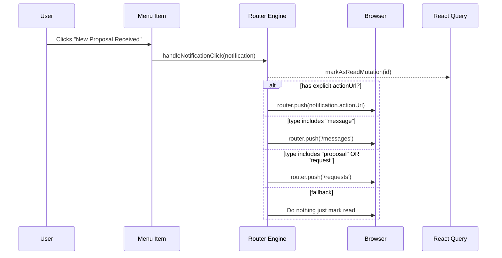

# 🔔 Comprehensive Notification System Guide

Welcome to the deep-dive technical documentation for the **Shoogl Notification System**.

Unlike the chat system which uses heavy, persistent WebSockets, our notification system uses an incredibly efficient **Smart Polling** architecture combined with **Optimistic UI Updates**. This guarantees that the UI feels instantaneously responsive without requiring a heavy server connection, saving bandwidth and backend resources.

---

## 🏛️ High-Level Flow Chart

The notification architecture resolves around the local `React Query Cache` acting as the absolute source of truth for the entire application (including the Navbar badge and the dedicated list).

```mermaid
flowchart TD
    API[(REST API<br/>/Notification)] 
    
    subgraph Background Process
        Poller(⏱️ 10s Smart Poller)
    </subgraph>
    
    subgraph Front-End Application
        Cache[(React Query Cache<br/>Key: 'notifications')]
        BadgeCount[(Query Cache<br/>Key: 'notifications-unread-count')]
        
        Hook(🧠 useNotifications Hook)
        
        Nav[🔔 Top Navbar Badge]
        Menu[📋 Dropdown Notification List]
    end

    API -.-> |JSON Payload| Poller
    Poller -.-> |Updates Data| Cache
    
    Cache --> Hook
    BadgeCount --> Hook
    
    Hook --> |Reactive State| Nav
    Hook --> |Reactive Array| Menu
    
    Menu --> |User Clicks 'Mark as Read'| Hook
    Hook --> |Instant UI Mutation| Cache
    Hook --> |Instant Count Drop| BadgeCount
    Hook --> |Background Sync| API
```

---

## ⏱️ 1. Smart Background Polling
File: `hooks/notifications/useNotifications.ts`

The foundation of the system is the `useQuery` hook. We set it up to passively fetch new notifications every 10 seconds.

```typescript
const QUERY_KEY = ["notifications"];

const { data: notifications = [], isLoading, refetch } = useQuery({
  queryKey: QUERY_KEY,
  queryFn: notificationsApi.getNotifications,
  // 1. Efficiency: Never poll if the user isn't logged in
  enabled: isAuthenticated, 
  // 2. Automagic: Check for new notifications every 10 seconds in the background
  refetchInterval: 10000,   
});

// We only care about unread notifications for the main badge and dropdown
const unreadNotifications = notifications.filter((n) => !n.isRead);
const unreadCount = unreadNotifications.length;
```

**Cross-Tab Synchronization:**
Because React Query isolates caching across browser tabs, if the user has 5 tabs open, React Query synchronizes them seamlessly via localStorage/BroadCast channels. Only *one* tab makes the network request, and the others instantly share the cached result, massively reducing server load.

---

## ⚡ 2. The Magic of Optimistic UI Updates
The most critical part of our UX is that when a user interacts with a notification (like clicking it to mark it as read), they should **not** have to wait for the backend to respond before the notification disappears.

We use **Optimistic Mutations** to visually apply the change to the DOM instantly, then gracefully send the request to the server in the background.

```typescript
const markAsReadMutation = useMutation({
  mutationFn: (id: string | number) => notificationsApi.markAsRead(id),
  
  // onMutate fires BEFORE the API request even leaves the browser!
  onMutate: async (id) => {
    // 1. Stop background polling so it doesn't accidentally revert our fast update
    await queryClient.cancelQueries({ queryKey: QUERY_KEY });
    
    // 2. Take a snapshot of the current state, so we can roll back if the API fails
    const previous = queryClient.getQueryData<any[]>(QUERY_KEY);
    
    // 3. OPTIMISTICALLY UPDATE LIST: Instantly change isRead to true in the local cache
    if (previous) {
      queryClient.setQueryData(
        QUERY_KEY,
        previous.map((n) => (n.id === id ? { ...n, isRead: true } : n))
      );
    }
    
    // 4. OPTIMISTICALLY UPDATE BADGE: Instantly decrement the top navbar badge count
    queryClient.setQueryData(
      ["notifications-unread-count"], 
      (prev: number) => Math.max(0, (prev || 0) - 1)
    );

    return { previous };
  },

  // If the API request failed (e.g., internet dropped), quickly roll back to the snapshot we took
  onError: (_, __, context) => {
    if (context?.previous) {
      queryClient.setQueryData(QUERY_KEY, context.previous);
    }
  },

  // Once the API finishes (success or fail), force a hard invisible refetch to ensure 100% sync
  onSettled: () => {
    queryClient.invalidateQueries({ queryKey: QUERY_KEY });
    queryClient.invalidateQueries({ queryKey: ["notifications-unread-count"] });
  },
});
```

### Why do we do this?
If the user's internet is slow (e.g., a 2-second ping), clicking a notification would normally cause the UI to freeze for 2 seconds. With this code, the DOM updates in **0.001 seconds**, and the 2-second delay happens invisibly in the background. If you click 5 notifications quickly, they all vanish instantly.

---

## 🧭 3. The Dynamic Router Engine
Notifications aren't just text; they are deep links into the application.

When a user clicks a notification in the UI drop-down, `handleNotificationClick` determines where the browser should logically navigate.



### The Implementation Code
```typescript
const handleNotificationClick = (notification: any) => {
  // 1. Instantly mark as read (triggers Optimistic Update)
  if (!notification.isRead) {
    markAsReadMutation.mutate(notification.id);
  }

  // 2. If the API explicitly provided an action URL, use it
  if (notification.actionUrl) {
    router.push(notification.actionUrl);
  } else {
    // 3. Otherwise, use a smart fallback parser based on the notification type
    const type = notification.type?.toLowerCase() || "";
    if (type.includes("message")) {
      router.push("/messages");
    } else if (type.includes("proposal") || type.includes("request")) {
      router.push("/requests");
    } else if (type.includes("project")) {
      router.push("/projects");
    } 
  }
};
```

## 🏁 Conclusion
The UI hook `useNotifications` combines automated background polling from React Query with manual optimistic mutations to create a robust, entirely decoupled, and exceptionally fast notification center for the application. No matter how many UI components (`TopNav`, `Sidebar`, `NotificationsPage`) use this hook, they will all instantly synchronize.
